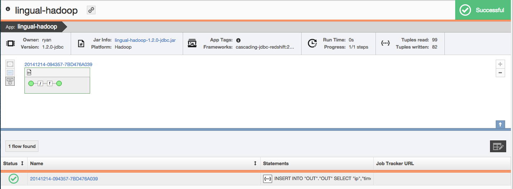

= Data Processing on Amazon Web Services (AWS)

== Part 1: Lingual Shell with HDFS and Redshift

=== What You Will See

In Part 1 of the tutorial, we will use Lingual shell to migrate data from HDFS to AWS Redshift. Cascading Lingual has two forms,
Lingual Shell (covered here) and Lingual-JDBC (covered in part 2 of this tutorial). Lingual is a powerful DSL on top of
Cascading that simplifies application development and integration by providing an ANSI SQL interface for Hadoop and AWS
Elastic MapReduce. Now you can connect existing business intelligence (BI) tools, optimize computing costs, and accelerate application development.
Going beyond ‘SQL-like’, Lingual is a mature implementation of ANSI/ISO standard SQL-92 built on top of the Cascading framework.
Further documentation can be found here, http://docs.cascading.org/lingual/1.2/[Lingual Docs]

=== Run and Validate Your Program

*Step 1:* If you have not done so already please refer to the prerequsites section for environment setup.

*Step 2:* Run your flow

[source,bash]
----
$ cd {path}/{to}/tutorials/cascading-aws/part1/scripts
$ chmod +x lingual_hdfs_redshift.sh
$ ./lingual_hdfs_redshift.sh [REDSHIFT_URL] [REDSHIFT_USER] [REDSHIFT_PASSWORD]
[PATH]/[TO]/cascading-jdbc/cascading-jdbc-redshift/build/libs/cascading-jdbc-redshift-2.6.0-wip-dev-provider.jar
/[HDFS]/[PATH]/[TO]/NASA_access_log_Aug95_short.ssv
----

*Step 3:* View the execution of your flow in real-time through Driven

Depending on how you configured your Driven Plugin, either click the
Driven URL from your console or log into the Driven application.

[source,bash]
----
14/12/20 12:01:53 INFO rest.DrivenDocumentService: *https://driven.cascading.io/index.html#/apps/[APP_ID]?view=element*
----

=== What’s Going On?

*Step 1:* The first thing we need to do in gather our command line arguments. After

[source,bash]
----
# gather argument variables
REDSHIFT_URL="$1"
REDSHIFT_USER="$2"
REDSHIFT_PASSWORD="$3"
CASCADING_JDBC_PATH="/Users/ryan/concurrent/lingual/cascading-jdbc/cascading-jdbc-redshift/build/libs/cascading-jdbc-redshift-2.6.0-wip-dev-provider.jar"
HDFS_DATA_FILES_PATH="/user/ryan/logs/"
----

*Step 2:* At this point we need to tell Lingual what platform to run on and where to find the Lingual
catalog. By default Lingual will install the catalog to /user/$USER/.lingual. For the purposes of this tutorial we will
clear the lingual catalog before each run of the sample script.

[source,bash]
----
# tell lingual which platform to run on (local or hadoop)
export LINGUAL_PLATFORM=hadoop
# location of Lingual catalog
CATALOG_PATH=/user/$USER/.lingual

# clear catalog if necessary
if hadoop fs -test -e $CATALOG_PATH ; then
  hadoop fs -rmr /user/$USER/.lingual
fi
----

*Step 3:* Lingual Initialization. Before we can start creating our Lingual tables and schemas we need to initialize the Lingual catalog. Since
we will be connecting to AWS Redshift we also need to add Redshift as a provider. In the project https://github.com/Cascading/cascading-jdbc[cascading-jdbc]
you will find the cascading-jdbc-redshift project. If you have not already cloned the cascading-jdbc project, please do so now and then compile
cascading-jdbc-redshift for our use in this tutorial. For the purposes of this tutorial we will also frequently use the "--show" command to print basic properties
of various entities to the console.

[source,bash]
----
# initialize lingual catalog
lingual catalog --init
# create cascading-jdbc-redshift provider
lingual catalog --provider --add ${CASCADING_JDBC_PATH} --showstacktrace
# view provider
lingual catalog --provider --show
----

*Step 4:* Schema, stereotype, and table definitions for source data. Lingual allows us to add schema and table definitions to just about any file or dataset.
Furthermore, it allows us to combine files of any format. The following section demonstrates the creation of our first Lingual schema and table.
In this case our source file is a text file on HDFS.

A schema consist of tables and optionally an external provider. A Table consists of a URI, Stereotype, a Format and a Protocol. Separating stereotype from table allows
the columns and type definitions to be shared across tables without having to re-register the redundant data.

[source,bash]
----
# create IN schema to read from in HDFS
lingual catalog --schema IN --add
# create stereotype and define columns and types
lingual catalog --schema IN --stereotype IN -add --columns ip,junk1,junk2,time1,offset,request,response,size --types string,string,string,string,string,string,int,int
# add format to schema
lingual catalog --schema IN --format ssv --add --provider text --extensions '.dat' --properties "delimiter=|"
# add table to schema and include path to data file(s)
lingual catalog --schema IN --table IN --stereotype IN -add ${HDFS_DATA_FILES_PATH} --format ssv
# show table
lingual catalog --schema IN --table IN --show
----

*Step 5:* Schema, stereotype, and table definitions for sink data. This will represent the Redshift table we would like to create a table and sink our data. Since we will want to create
and/or replace this table on Redshift we need to define the format as postgresql, the protocol as JDBC, and the provider as Redshift. We will also
add the properties of the table we would like to create/replace in Redshift.

[source,bash]
----
# create OUT schema to read from in HDFS
lingual catalog --schema OUT --add --showstacktrace
# create stereotype and define columns and types
lingual catalog --schema OUT --stereotype OUT -add --columns ip,time1,request,response,size --types string,string,string,int,int --showstacktrace
# add format to schema
lingual catalog --schema OUT --format postgresql --add --provider redshift --showstacktrace
# add protocol and table definition to schema
lingual catalog --schema OUT --protocol jdbc --add --properties="tabledesc.tablename=OUT,tabledesc.columnnames=ip:time1:request:response:size,tabledesc.columndefs=varchar(100):varchar(100):varchar(250):int:int,jdbcuser=${REDSHIFT_USER},jdbcpassword=${REDSHIFT_PASSWORD},usedirectinsert=true,sinkmode=REPLACE"  --provider redshift --showstacktrace
# add protocol format - postgresql
lingual catalog --schema OUT --protocol jdbc --format postgresql --add --provider redshift --showstacktrace
# add table to schema
lingual catalog --schema OUT --table OUT --stereotype OUT --add ${REDSHIFT_URL}  --protocol jdbc  --format postgresql --provider redshift --showstacktrace
# show table
lingual catalog --schema OUT --table OUT --show
----

*Step 6:* Now, as promised we will execute our SQL statement to migrate the wanted data from HDFS to Redshift.

[source,bash]
----
echo "INSERT INTO \"OUT\".\"OUT\" SELECT \"ip\",\"time1\",\"request\",\"response\",\"size\" FROM \"IN\".\"IN\" WHERE \"response\" = 200;" | lingual shell --showstacktrace
----

Congratulations, you just ran ANSI SQL on Hadoop using Cascading Lingual!

=== References
. Lingual home page - http://www.cascading.org/projects/lingual/
. Lingual docs - http://docs.cascading.org/lingual/1.2/
. Lingual source - https://github.com/Cascading/lingual

== Next:
=== Part 2
link:part2.html[Simple ETL using Lingual JDBC with S3, EMR and Redshift]
