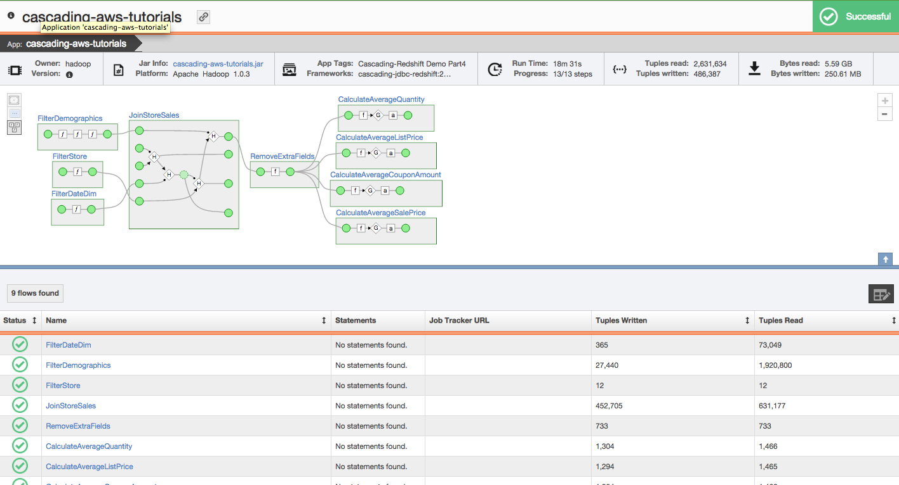

= Data Processing on Amazon Web Services (AWS)

== Part 3: ETL on EMR with Cascading using S3 and Redshift

=== What You Will See
In Part 3 of this tutorial we will change things up a bit and dive into ETL with Cascading on AWS.
We will use hashjoins, cogroups, filters, each pipes, subassemblies and several flows running within Cascades on
bootstrap EMR clusters. In the end we will trigger Redshift's COPY command, which is built into Cascading's
RedshiftTap to push the data to Redshift in bulk. You may also add the Driven bootstrap option to the EMR cluster
to send your telemetry from EMR to https://driven.cascading.io[https://driven.cascading.io].

Part 3 of this tutorial also has two components, a shell script that manages the compilation,
required data transfers and EMR cluster creation, as well as a Java application
(./cascading-aws/part3/src/main/java/cascading/aws/SampleFlow.java) that will be executed on the EMR cluster.

==== emrExample.sh

When you call the script part3/src/scripts/emrExample.sh with the required arguments the following
will take place:

. clean and compile part 3 of the tutorial

. use aws cli to create new S3 bucket or delete contents if bucket already exists

. use aws cli to push five data files and compiled jar file to S3 bucket

. use aws cli to create an EMR cluster - providing the location of the data
and jar file for execution

==== SampleFlow.java

We will take a closer look at the SampleFlow.java in the "What's Going On?" section below. However, in short
it is tasked with sourcing various .dat files from S3, performing several ETL operations on AWS EMR and sinking
the results to Redshift.

=== Run and Validate Your Program

*Step 1:* If you have not done so already please refer to the prerequsites section for environment setup.

*Step 2:* If you would like to use Driven to visualize and monitor this application please edit part3/src/scripts/emrExample.sh.
You will need to have a valid http://cascading.io/register/[Driven Cloud Service] account. To use Driven please
ensure you have modified emrExample.sh like so:

[source,bash]
----
# Uncomment to use Driven
DRIVEN_API_KEY=[YOUR DRIVEN API KEY]
DRIVEN_VERSION="1.2"
INSTALL_PLUGIN_URL="s3://wip.concurrentinc.com/driven/${DRIVEN_VERSION}/driven-plugin/install-driven-plugin.sh"
DRIVEN_SERVER_HOSTS="https://driven.cascading.io"
----

Also, further below please add the Driven bootstrap action to the aws emr create-cluster command:

[source,bash]
----
aws emr create-cluster \
  --ami-version 3.3.1 \
  --instance-type $INSTANCE_TYPE \
  --instance-count $INSTANCE_COUNT \
  --bootstrap-actions Path=$INSTALL_PLUGIN_URL,Name=DRIVEN_BOOTSTRAP,Args="--host,${DRIVEN_SERVER_HOSTS}","--api-key,${DRIVEN_API_KEY}" \
  --name "cascading-aws-tutorial-3" \
  --visible-to-all-users \
  --enable-debugging \
  --auto-terminate \
  --no-termination-protected \
  --log-uri s3n://$BUCKET/logs/ \
  --steps Type=CUSTOM_JAR,Name=Part3,ActionOnFailure=TERMINATE_CLUSTER,Jar=s3n://$BUCKET/$NAME,Args=$REDSHIFT_URL,$REDSHIFT_USER,$REDSHIFT_PASSWORD,$AWS_ACCESS_KEY,$AWS_SECRET_KEY,$BUCKET
----

Now, when your Cascading application is running on the EMR cluster you will be able to visualize it and monitor it in real time.
Driven has many useful features to successfully scale and productize your data applications. Please see http://cascading.io/try/[Driven]
for further information.

You can use this live http://showcase.cascading.io/index.html#/apps/1A9C4C053BB64C698B0FE01BD700FCBB?view=element[link] to view the
application in Driven.

*Step 3:* Call the script from the tutorials/cascading-aws home directory.

[source,bash]
----
$ cd ./[PATH]/[TO]/cascading-tutorials/cascading-aws/
$ part3/src/scripts/emrExample.sh [REDSHIFT_URL] [REDSHIFT_USER] [REDSHIFT_PASSWORD] [S3_BUCKET] [AWS_ACCESS_KEY]
[AWS_SECRET_KEY]
----

The script logs all calls and output to the console. When it is complete you should see the following:

[source,bash]
----
{
    "ClusterId": "[CLUSTER_ID]"
}
----

*Step 4:* Inspect https://console.aws.amazon.com/s3/home[AWS S3] for the bucket you specified when calling the
emrExample.sh script. Ensure that the busket exists and that it contains one jar file and five .dat files. The EMR cluster
will also write it's log files to [BUCKET]/logs and the application will write to [BUCKET]/output.

*Step 5:* Inspect your https://console.aws.amazon.com/elasticmapreduce/home[AWS EMR console] for the new cluster. Here
you can monitor progress of each step and gather other valuable information. If there are any errors during execution
you will find them by selecting the cluster in question, and then selecting "Steps" where you will be able to view logs
for any failed jobs.

*Step 6:* View your 5 new tables in Redshift using SQLWorkbenchJ.

*Step 7:* View the execution of your flow in real-time through Driven

Depending on how you configured your Driven Plugin, either click the
Driven URL from your console or log into the Driven application.

[source,bash]
----
14/12/20 12:01:53 INFO rest.DrivenDocumentService: *https://driven.cascading.io/index.html#/apps/[APP_ID]?view=element*
----

=== What’s Going On?

==== emrExample.sh

First, let's take a closer look at the shell script (./cascading-aws/part3/src/scripts/emrExample.sh).
The primary points of interest include:

Cleaning and compiling the program:

[source,bash]
----
# clean and build part 3 application
gradle :part3:clean :part3:jar
----

AWS CLI commands to create or empty S3 bucket and transfer required files:

[source,bash]
----
# create the bucket or delete the contents if it exists
aws s3 mb s3://$BUCKET || aws s3 rm s3://$BUCKET --recursive

# push required data files to S3
aws s3 cp data/date_dim.dat s3://$BUCKET/cascading-aws-data/
aws s3 cp data/store_sales.dat s3://$BUCKET/cascading-aws-data/
aws s3 cp data/item.dat s3://$BUCKET/cascading-aws-data/
aws s3 cp data/store.dat s3://$BUCKET/cascading-aws-data/
aws s3 cp data/customer_demographics.dat s3://$BUCKET/cascading-aws-data/

# push built jar file to S3
aws s3 cp $BUILD/$NAME s3://$BUCKET/$NAME
----

The AWS CLI command to create an EMR cluster - providing all necessary information to run the application we
just compiled and sent to S3. Notice the bootstrap-action for Driven. If you have not set up your Driven account
and supplied you API key as previously mentioned please remove the "--bootstrap-actions" line from the following
section:

[source,bash]
----
# uncomment and add the following to elastic-mapreduce call below if using driven
# --bootstrap-actions Path=$INSTALL_PLUGIN_URL,Name=DRIVEN_BOOTSTRAP,Args="--host,${DRIVEN_SERVER_HOSTS}","--api-key,${DRIVEN_API_KEY}" \

aws emr create-cluster \
  --ami-version 3.3.1 \
  --instance-type $INSTANCE_TYPE \
  --instance-count $INSTANCE_COUNT \
  --name "cascading-aws-tutorial-3" \
  --visible-to-all-users \
  --enable-debugging \
  --auto-terminate \
  --no-termination-protected \
  --log-uri s3n://$BUCKET/logs/ \
  --steps Type=CUSTOM_JAR,Name=Part3,ActionOnFailure=TERMINATE_CLUSTER,Jar=s3n://$BUCKET/$NAME,Args=$REDSHIFT_URL,$REDSHIFT_USER,$REDSHIFT_PASSWORD,$AWS_ACCESS_KEY,$AWS_SECRET_KEY,$BUCKET
----

==== SampleFlow.java

Now to the java application. There are five primary sections of logic in Part 3 (./cascading-aws/part3/src/main/java/cascading/aws/SampleFlow.java).
Let's take a closer look:

*Step 1:* declare our Fields, table columns and column types

[source,java]
----
// create Cascading Fields for date_dim data
public static final Fields DATE_DIM_FIELDS = new Fields(...)
// create Redshift table fields for date_dim data
public static final String[] DATE_DIM_TABLE_FIELDS = new String[]{...}
// create Redshift column types for date_dim data
public static final String[] DATE_DIM_TABLE_TYPES = new String[]{...}

// continue for additional files and tables
// ...
----

*Step 2:* Initialize the application

[source,java]
----
Properties properties = new Properties();
AppProps.setApplicationJarClass( properties, Main.class );
// add ApplicationTag for Driven identification and search functionality
AppProps.addApplicationTag( properties, "Cascading-Redshift Demo Part3" );
HadoopFlowConnector flowConnector = new HadoopFlowConnector( properties );
----

*Step 3:* Filter data using http://docs.cascading.org/cascading/1.2/javadoc/cascading/operation/regex/RegexFilter.html[RegexFilter]
and http://docs.cascading.org/cascading/2.1/javadoc/cascading/pipe/Each.html[Each] pipes - Source from S3 sink to Redshift

[source,java]
----
List<Flow> queryFlows = new ArrayList<Flow>();

// create FlowDef for date filter flow
FlowDef dateDimFilterFlow = FlowDef.flowDef();
// give name to FlowDef for Driven visibility
dateDimFilterFlow.setName( "FilterDateDim (Redshift Sink)" );
// create initial Pipe
Pipe inputFilesPipe = new Pipe( "datedim_filter" );
// create RegexFilter to filter for all data from 2002
RegexFilter regexFilter = new RegexFilter( "2002" );
// create Each pipe to iterate over each record and apply regexFilter
inputFilesPipe = new Each( inputFilesPipe, new Fields( "d_year" ), regexFilter );
// add source and pipe to dateDimFilterFlow
dateDimFilterFlow.addSource( inputFilesPipe, new Hfs( new TextDelimited( DATE_DIM_FIELDS, "|" ), "s3://dataset-samples-ryan/tpc-ds/date_dim.dat" ) );

Tap dateDimSinkTap = getOutputTap( "filtered_date_dim", Fields.ALL );
// add tail sink to dateDimFilterFlow
dateDimFilterFlow.addTailSink( inputFilesPipe, dateDimSinkTap );

// add dateDimFilterFlow to queryFlows ArrayList for later use
queryFlows.add( flowConnector.connect( dateDimFilterFlow ) );

// repeat for Demographics and Store data
// ...
----

*Step 4:* Perform a series of http://docs.cascading.org/cascading/2.0/javadoc/cascading/pipe/HashJoin.html[HashJoins]

[source,java]
----
Map<String, Tap> sources = new HashMap<String, Tap>();
 Map<String, Tap> sinks = new HashMap<String, Tap>();

 // create Redshift table for sales<>item join results
 Tap storeSaleItemSink = getOutputTap( "store_sales_item_join", Fields.ALL );
 sinks.put( "store_sales_item_join", storeSaleItemSink );

 // everything joins against store_sales so put that in first.
 Tap storeSales = new Hfs( new TextDelimited( STORE_SALES_FIELDS, "|" ), "s3://dataset-samples-ryan/tpc-ds/store_sales.dat" );
 sources.put( "StoreSales", storeSales );
 Pipe storeSalesPipe = new Pipe( "StoreSales" );

 // JOIN item on (store_sales.ss_item_sk = item.i_item_sk)
 Tap item = new Hfs( new TextDelimited( ITEM_FIELDS, "|" ), "s3://dataset-samples-ryan/tpc-ds/item.dat" );
 sources.put( "Item", item );
 Pipe itemPipe = new Pipe( "Item" );
 Pipe storeSalesItemJoin = new HashJoin( "store_sales_item_join", storeSalesPipe, new Fields( "ss_item_sk" ), itemPipe, new Fields( "i_item_sk" ) );

// continue for joins on date_dim, store_sales, customer_demographics
// ...

// wire all the join flows together
queryFlows.add( flowConnector.connect( "JoinStoreSales (Redshift Sources)", sources, sinks, storeSalesItemJoin, storeSalesDateDimJoin, storeSalesCustomerDemographicsJoin, storeSalesStoreJoin ) );
----

*Step 5:* Strip out extraneous fields using http://docs.cascading.org/cascading/2.0/javadoc/cascading/pipe/assembly/Retain.html[Retain]

[source,java]
----
/*
* Strip out extraneous fields now
*/
Fields finalFields = new Fields( new Comparable[]{"i_item_id", "s_state", "ss_quantity", "ss_list_price", "ss_coupon_amt", "ss_sales_price"}, new Type[]{String.class, String.class, Double.class, Double.class, Double.class, Double.class} );
FlowDef fieldRemovingFlowDef = FlowDef.flowDef();
fieldRemovingFlowDef.setName( "RemoveExtraFields" );
Pipe allFieldsPipe = new Pipe( "all_fields" );
Pipe fieldRemovingPipe = new Retain( allFieldsPipe, finalFields );
fieldRemovingFlowDef.addSource( fieldRemovingPipe, storeSaleCustDemSink );
RedshiftTableDesc redactedFieldsTapTableDescriptor = new RedshiftTableDesc( "all_fields", SALES_REPORT_TABLE_FIELDS, SALES_REPORT_TABLE_TYPES, null, null );
Tap redactedFieldsTap = new RedshiftTap( redshiftJdbcUrl, redshiftUsername, redshiftPassword, S3_PATH_ROOT + "all_fields", awsCredentials, redactedFieldsTapTableDescriptor, new RedshiftScheme( SALES_REPORT_FIELDS, redactedFieldsTapTableDescriptor ), SinkMode.REPLACE, true, false );
fieldRemovingFlowDef.addTailSink( fieldRemovingPipe, redactedFieldsTap );
queryFlows.add( flowConnector.connect( fieldRemovingFlowDef ) );
----

*Step 6:* Calculate averages using   https://github.com/Cascading/cascading-Redshift/blob/wip-1.0/src/main/java/cascading/flow/Redshift/RedshiftFlow.java[RedshiftFlow]

[source,java]
----
/*
* Compute the averages by item and state and join them
 */
Fields groupingFields = new Fields( "i_item_id", "s_state" ).applyTypes( String.class, String.class );

FlowDef calculateQuantityResults = FlowDef.flowDef();
calculateQuantityResults.setName( "CalculateAverageQuantity" );
Pipe quantityAveragingPipe = new Pipe( "quantity_average" );
quantityAveragingPipe = new AverageBy( quantityAveragingPipe, groupingFields, new Fields( "ss_quantity" ), new Fields( "ss_quantity" ) );
calculateQuantityResults.addSource( quantityAveragingPipe, redactedFieldsTap );
Fields quantity_average_fields = new Fields( "i_item_id", "ss_quantity", "s_state" ).applyTypes( String.class, Double.class, String.class );
RedshiftTableDesc avgQuantityTableDescriptor = new RedshiftTableDesc( "quantity_average", new String[]{"i_item_id", "ss_quantity", "s_state"}, new String[]{"varchar(100)", "decimal(7,2)", "varchar(100)"}, null, null );
Tap quantityAverageTap = new RedshiftTap( redshiftJdbcUrl, redshiftUsername, redshiftPassword, S3_PATH_ROOT + "quantity_average", awsCredentials, avgQuantityTableDescriptor, new RedshiftScheme( quantity_average_fields, avgQuantityTableDescriptor ), SinkMode.REPLACE, true, false );
calculateQuantityResults.addTailSink( quantityAveragingPipe, quantityAverageTap );
queryFlows.add( flowConnector.connect( calculateQuantityResults ) );

// continue for average price, average coupon amount, average sales price
// ...
----

*Step 7:* Join averages using http://docs.cascading.org/cascading/2.0/javadoc/cascading/pipe/CoGroup.html[CoGroup] and
discard unwanted fields using http://docs.cascading.org/cascading/2.0/javadoc/cascading/pipe/assembly/Discard.html[Discard]

[source,java]
----
/*
* Join the averages together
 */
Map<String, Tap> reportSources = new HashMap<String, Tap>();
Map<String, Tap> reportSinks = new HashMap<String, Tap>();
Map<String, Tap> traps = new HashMap<String, Tap>();

reportSources.put( "QuantityAveragePipe", quantityAverageTap );
Pipe quantityAveragePipe = new Pipe( "QuantityAveragePipe" );
reportSources.put( "ListPriceAverage", listPipeAverageTap );
Pipe listPriceAveragePipe = new Pipe( "ListPriceAverage" );
reportSources.put( "CouponAmountAverage", couponAmountAverageTap );
Pipe couponAmountAveragePipe = new Pipe( "CouponAmountAverage" );
reportSources.put( "SalePriceAverage", salePriceAverageTap );
Pipe salePriceAveragePipe = new Pipe( "SalePriceAverage" );

groupingFields = new Fields( "i_item_id", "s_state" ).applyTypes( String.class, String.class );
Fields junkFields = new Fields( "i_item_id_junk", "s_state_junk" ).applyTypes( String.class, String.class );
Fields SalesReportQLFields = new Fields( "i_item_id", "s_state", "ss_quantity", "i_item_id_junk", "s_state_junk", "ss_list_price" ).applyTypes( String.class, String.class, Double.class, String.class, String.class, Double.class );
Fields SalesReportQLCFields = new Fields( "i_item_id", "s_state", "ss_quantity", "ss_list_price", "i_item_id_junk", "s_state_junk", "ss_coupon_amt" ).applyTypes( String.class, String.class, Double.class, Double.class, String.class, String.class, Double.class );
Fields SalesReportFields = new Fields( "i_item_id", "s_state", "ss_quantity", "ss_list_price", "ss_coupon_amt", "i_item_id_junk", "s_state_junk", "ss_sales_price" ).applyTypes( String.class, String.class, Double.class, Double.class, Double.class, String.class, String.class, Double.class );

Fields gFields = new Fields( "i_item_id" ).applyTypes( String.class );

// cogroup quantityAveragePipe & listPriceAveragePipe on "i_item_id" and "s_state"
Pipe salesReportPipe = new CoGroup( "SalesReportQL", quantityAveragePipe, gFields, listPriceAveragePipe, gFields, SalesReportQLFields );
// strip unnecessary fields from salesReportPipe
salesReportPipe = new Discard( salesReportPipe, junkFields );
// cogroup salesReportPipe & couponAmountAveragePipe on "i_item_id" and "s_state"

salesReportPipe = new CoGroup( "SalesReportQLC", salesReportPipe, gFields, couponAmountAveragePipe, gFields, SalesReportQLCFields );
// strip unnecessary fields from salesReportPipe
salesReportPipe = new Discard( salesReportPipe, junkFields );
// cogroup salesReportPipe & salePriceAveragePipe on "i_item_id" and "s_state"
salesReportPipe = new CoGroup( "SalesReport", salesReportPipe, gFields, salePriceAveragePipe, gFields, SalesReportFields );
// strip unnecessary fields from salesReportPipe
salesReportPipe = new Discard( salesReportPipe, junkFields );
----

*Step 8:* Connect all flows and complete http://docs.cascading.org/cascading/2.1/javadoc/cascading/cascade/Cascade.html[Cascade]

[source,java]
----
// create, connect (all flows from queryFlows) and complete cascade
CascadeConnector connector = new CascadeConnector();
Cascade cascade = connector.connect( queryFlows.toArray( new Flow[ 0 ] ) );
cascade.complete();
----

=== References
. cascading-jdbc-redshift - https://github.com/Cascading/cascading-jdbc/tree/2.7/cascading-jdbc-redshift
. Sorting using GroupBy and CoGroup - http://docs.cascading.org/cascading/2.6/userguide/html/ch03s03.html#N205A3
. AWS Command Line Interface - http://aws.amazon.com/cli/

Congratulations, you have now gone through the creation of end-to-end data processing workflows using Cascading and AWS!
